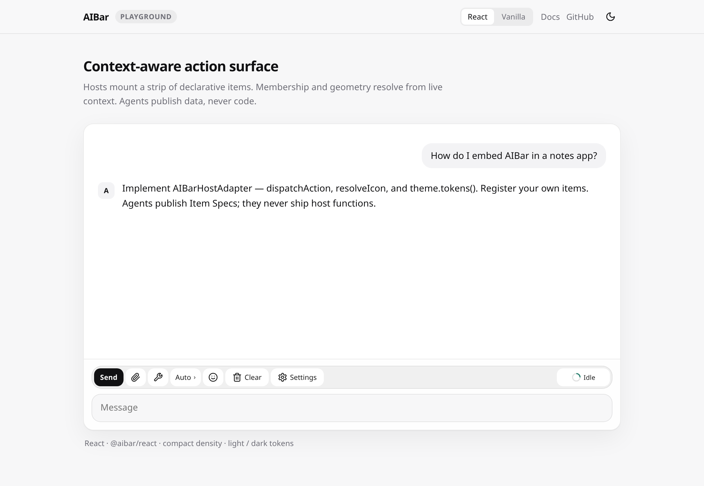
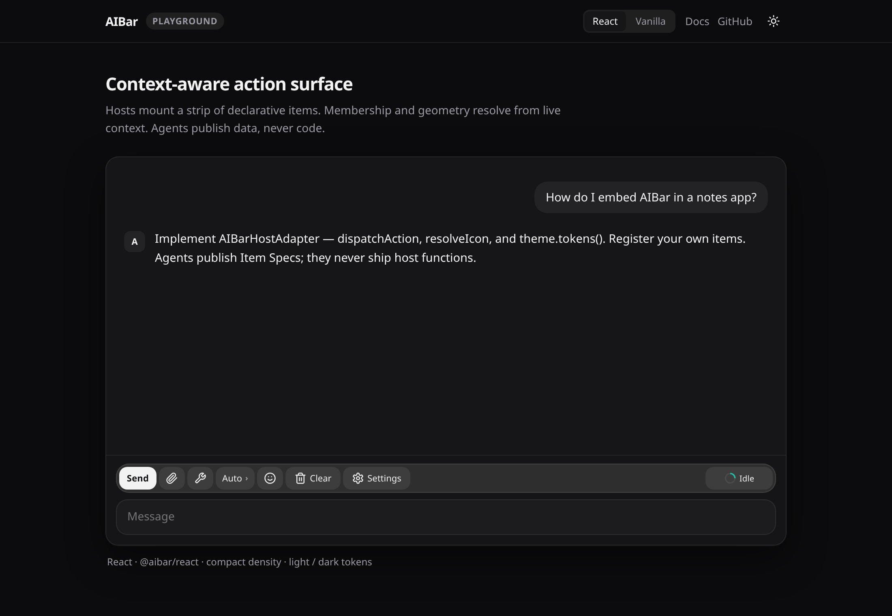

# AIBar

Context-aware action surface for product hosts. You mount a strip of
declarative items; membership, order, and geometry resolve from live context.
Agents publish **data, never code**.

<p align="center">
  
</p>
<p align="center">
  
</p>

LeAgent is one host. This repository is the library.

| Package | Role |
|---------|------|
| [`@aibar/protocol`](protocol) | Item Spec v2, identifiers, predicate DSL, wire, JSON Schema |
| [`@aibar/core`](core) | Kernel, resolver, HostAdapter SPI (no DOM, no React) |
| [`@aibar/intent`](intent) | Optional heuristic suggestion engine |
| [`@aibar/renderer-dom`](renderer-dom) | DOM backend + `--aibar-*` CSS |
| [`@aibar/react`](react) | `AIBarSurface` mount (peer React 18 / 19) |
| [`@aibar/devtools`](devtools) | Optional inspection overlay |

**Docs:** [architecture](docs/aibar-architecture.md) · [host guide](docs/aibar-host-guide.md)

## Install

```bash
npm install && npm test && npm run build
```

```ts
import { AIBarSurface, createAIBarKernel } from '@aibar/react';
import { createDefaultHostAdapter, defineItem } from '@aibar/core';
import '@aibar/renderer-dom/styles.css';
```

`createDefaultHostAdapter` ships Lucide-style SVG icons and light / dark
`--aibar-*` tokens. Replace `dispatchAction`, `resolveIcon`, and `theme` with
your host.

## Examples

[`examples/playground`](examples/playground) — React at `/`, vanilla DOM at
`/vanilla.html`. Shared catalog, theme, and chrome.

```bash
cd examples/playground && npm run dev
```

The catalog in `examples/playground/src/catalog.ts` is generic on purpose —
copy it and swap in your own items. Toggle light / dark from the nav, or open
`?theme=light` / `?theme=dark`.

Refresh README screenshots after UI changes:

```bash
npm run capture:readme
```

## Versioning

Independent of any host (`0.1.0`, Changesets). A protocol bump `aibar/2` →
`aibar/3` is a **major** of `@aibar/protocol` and every consumer.

Publishing requires the npm org **`@aibar`**. First release is tag `v0.1.0`.

## Used as a Git submodule (LeAgent)

[LeAgent](https://github.com/vixues/LeAgent) vendors this repo at `packages/`:

```bash
git clone --recurse-submodules git@github.com:vixues/LeAgent.git
```

LeAgent records a **pinned commit**, not a branch. To bump:

```bash
cd packages
git fetch origin && git checkout <commit-or-tag>
cd ..
git add packages
git commit -m "chore: bump AIBar submodule"
```
