# Meet AIBar: The Action Bar That Keeps Up With Your Agent

*A feature tour of LeAgent’s AI action bar — the strip above chat that surfaces send, GenUI, approvals, and agent next steps in one place.*

---

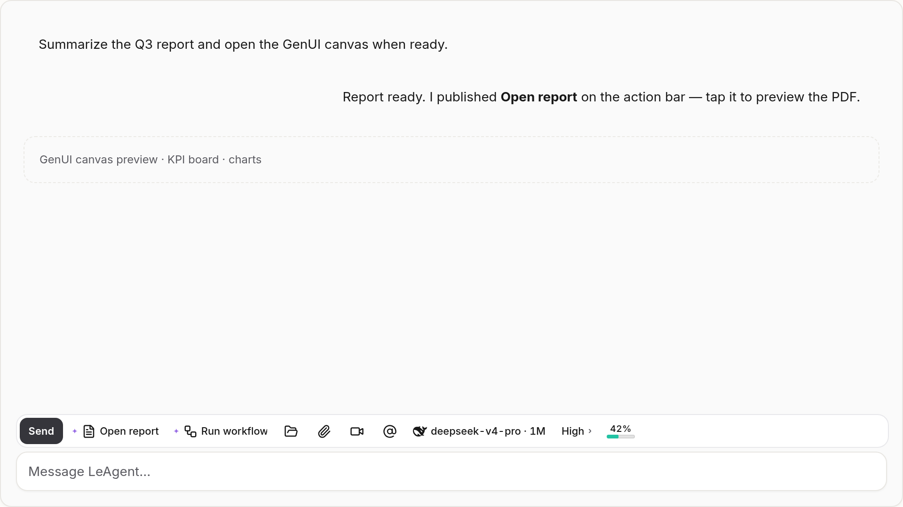

*Figure 1. AIBar is the persistent strip above the composer — your next actions, always in reach.*

---

## Why another bar?

In agent chat, the hard part is rarely “what did the model say?” — it’s “what can I do *now*?”

Open a canvas. Switch reasoning intensity. Allow a tool. Attach a folder. Jump back to a generated report. Those actions used to live in five different corners of the UI. **AIBar** pulls them onto one context-aware surface docked above the composer, so the next tap is obvious without burying you in menus.

Think Touch Bar energy: a short strip that changes with what you’re doing — typing, reviewing GenUI, waiting on the agent, or confirming a risky step.

---

## Where you’ll find it

AIBar appears on chat routes (`/` and `/home`), above the message composer. It’s available on desktop; the mobile layout keeps the composer clean and hides the strip. You can turn the whole surface on or off in **Settings → AIBar**.

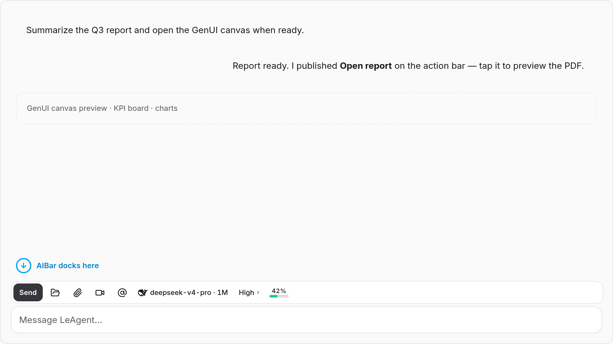

*Figure 2. Docked between the conversation and the composer — close to where you type, not competing with the transcript.*

---

## Composer controls, lifted onto the bar

When you’re not typing, AIBar acts as **composer chrome**: the controls you expect next to the input, laid out for glanceable use.

| Control | What it does |
|---------|----------------|
| **Send / Stop** | Submit the message, or halt a running turn |
| **Attach / Camera / Mention** | Add files, capture a photo, or insert a mention |
| **Local folders** | Grant or manage folder access for tools that need the filesystem |
| **Model chip** | Switch the chat model without opening a separate panel |
| **Reasoning** | Expand inline to set Auto / Off / Low / High / Max |
| **Context usage** | See how full the context window is getting |

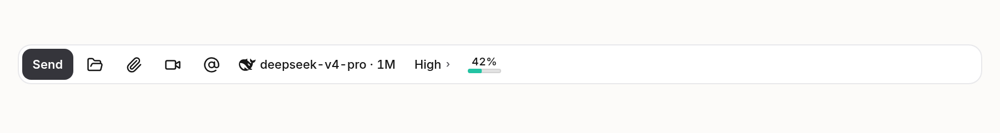

*Figure 3. Send, model, reasoning, folders, and usage live on the bar when the composer is idle.*

---

## Typing mode: candidates, emoji, and recent images

Focus the textarea and the strip **shifts into input mode**. Chrome steps aside so typing aids can take the space:

- **Typing suggestions** — local candidates based on what you’ve started
- **Emoji picker** — categorized glyphs (frequent, smileys, gestures, animals, and more)
- **Recent images** — a scrubber of session images you can reuse quickly

Blur the composer and chrome returns. Open popovers (emoji, reasoning) stay stable while you’re using them, so the bar doesn’t flicker when focus briefly moves.

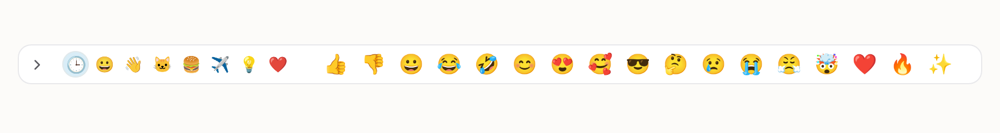

*Figure 4. While you type, AIBar becomes a lightweight input accessory — not another settings row.*

### Interactive expand demos

The strip is meant to be tapped, not just looked at. These loops are captured from the real AIBar kernel (open → hold → close):

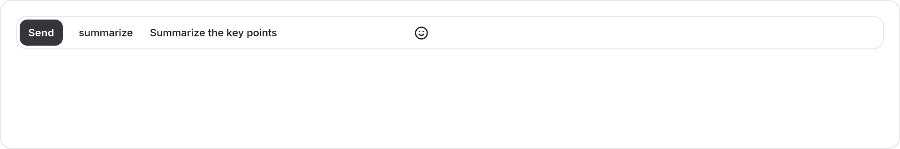

*Figure 4a. Emoji popover — categories + scrubber take over the strip, Escape closes.*

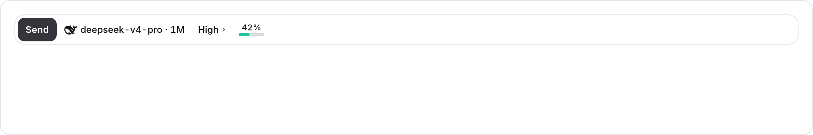

*Figure 4b. Reasoning expands inline so intensity chips splice into the ground strip.*

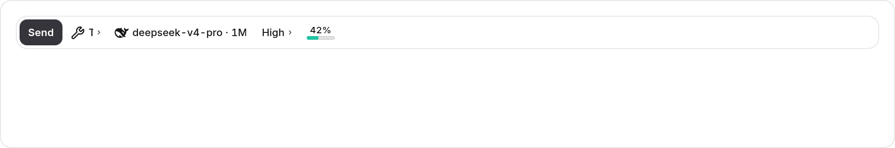

*Figure 4c. Surface expand swaps the whole bar (Touch Bar–style) with an Escape Zone.*


*Figure 4d. GenUI zone opens as a labeled action popover when a canvas is in play.*

---

## GenUI at your fingertips

When the agent streams a live interface — a canvas, KPI board, gallery, or other GenUI tree — AIBar grows a **GenUI zone**:

- Open / focus / close the canvas  
- Locate UI in the transcript  
- Enlarge for a closer look  
- Screenshot  
- Export PDF  

You don’t hunt for a floating toolbar on the canvas alone; the same session’s bar knows a GenUI surface is active and offers the right controls.

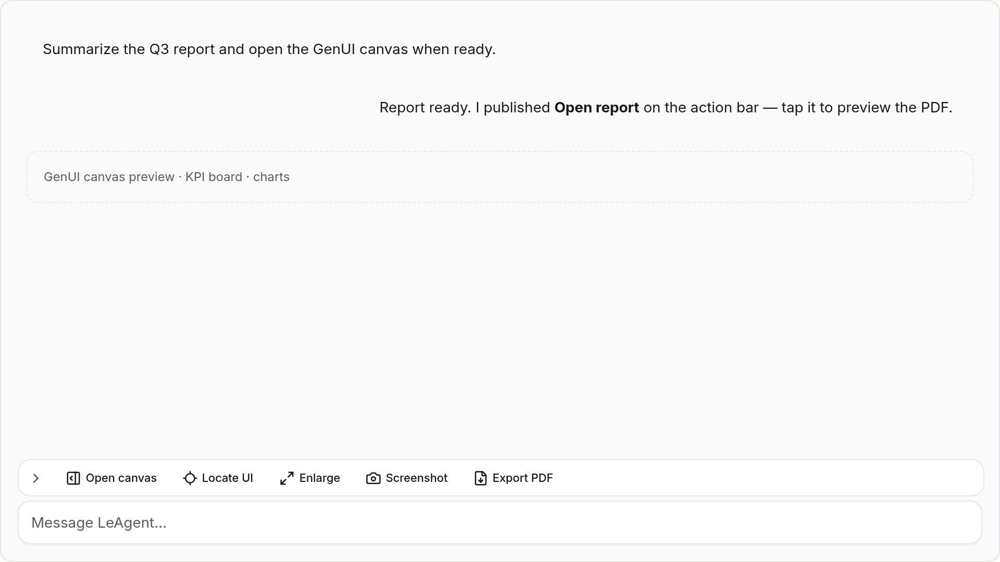

*Figure 5. GenUI controls appear when there’s something to open, focus, or export.*

---

## Agent-published next actions

Agents can publish short, high-value buttons onto the bar — for example **Open report**, **Run workflow**, or a suggested follow-up message.

Those items show an **AI badge** so you always know they came from the agent, not from host chrome. They compete for limited space (usually one to three good actions beat a noisy row), expire or clear when the turn moves on, and never replace the host controls you rely on every day.

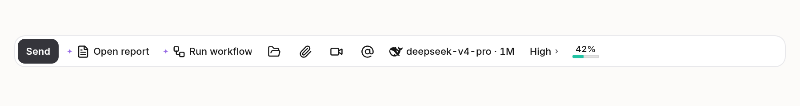

*Figure 6. Declarative “do this next” buttons from the agent, clearly marked.*

---

## Approvals without leaving the strip

When the agent needs permission — a tool call, a gated effect — AIBar can mirror **Allow / Deny** on the bar itself. You stay in the same visual lane as send and stop, instead of hunting a separate permission card (those still exist for parity; the bar is the fast path).

Destructive actions still ask for an explicit confirm. The bar speeds up routine approvals; it does not skip the human gate.

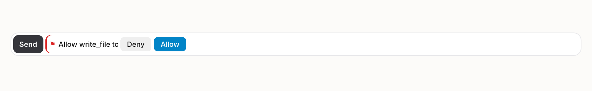

*Figure 7. Permission decisions land where your hands already are.*

---

## Suggestions that stay in their lane

Beyond hard agent buttons, AIBar can show **soft suggestions** — predicted next steps with a confidence threshold. They occupy a dedicated suggestion lane, are dismissible, and never shove send, model, or GenUI controls out of the way.

In Settings you can tune how many suggestion slots appear and mute categories you don’t want.

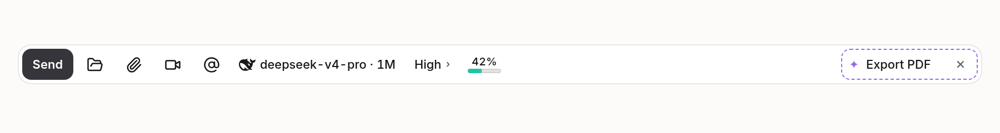

*Figure 8. Suggestions help; they don’t hijack the strip.*

---

## Overflow and the command palette

Screens get narrow. Items get pinned. When the strip runs out of room, AIBar doesn’t silently drop features — it folds them under **More**, with a path into the **command palette** so every action remains reachable.

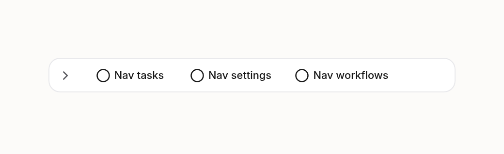

*Figure 9. When space runs out, overflow keeps capabilities one click away.*

---

## Make it yours

AIBar is meant to be lived in, so it supports everyday customization:

- **Pin / unpin / hide / reorder** items (context menu and customize sheet)  
- **fnMode** — hold Alt / Option for an alternate control set  
- **Themes** — instrument, adaptive, artistic, cartoon  
- **Density** — compact or regular  
- **Creature Ranch** — optional System Strip pet / farm yard (feed, pet, walk, sleep, stage), with Pixel Studio for skins  

Reset ranking stats, suggestion learning, or customization from Settings if you want a clean slate.

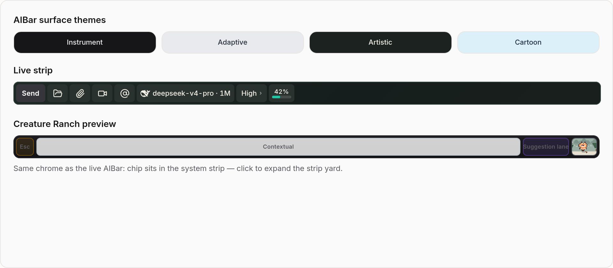

*Figure 10. Pin what you use, theme the surface, or open Creature Ranch when you want a break.*

---

## A day in the life (one session)

1. **Start a chat** — chrome shows model, reasoning, attach, send.  
2. **Type a prompt** — candidates and emoji take over; send stays principal.  
3. **Agent runs** — live status / working indicators; Stop replaces Send.  
4. **Tool needs approval** — Allow / Deny appear on the bar.  
5. **GenUI streams in** — open canvas, screenshot, export PDF from the GenUI zone.  
6. **Artifact is ready** — agent publishes “Open report”; you tap once.  
7. **Session images pile up** — scrub recent images without leaving chat.  
8. **Bar gets crowded** — overflow → More / command palette; your pins stay put.

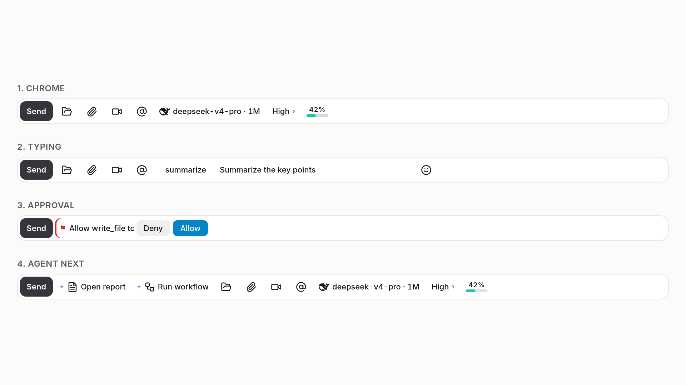

*Figure 11. Same strip, different jobs — as the turn progresses.*

---

## What AIBar is *not* for

A few boundaries keep the product clear:

- **Not a second chat box** — prose still belongs in the transcript and composer.  
- **Not a dumping ground for every tool** — agents should publish sparingly.  
- **Not the only path** — every bar action has (or declares) a non-AIBar fallback: a link in the reply, a settings panel, a permission card.  
- **Not markdown `:::ask` blocks** — those fill the composer for one-shot questions; AIBar is for ambient, reusable actions.

---

## Try it

1. Enable **AIBar** under Settings (if it isn’t already).  
2. Open a desktop chat session.  
3. Watch the strip switch between chrome and typing mode as you focus the composer.  
4. Ask the agent for something that produces a file or GenUI canvas — and look for next actions on the bar.  
5. Right-click an item to pin or hide; open Settings → AIBar to tune themes, density, suggestions, and Creature Ranch.

AIBar’s job is simple: when the agent has done useful work, **the next useful move should already be under your cursor**.

---

---

### Regenerating figures

Static figures: DEV gallery
[`/_dev/aibar-capture`](http://localhost:5173/_dev/aibar-capture)
(Export all), or:

```bash
node scripts/capture-aibar.mjs
```

Interactive GIFs (emoji / reasoning / surface / GenUI expand):

```bash
node scripts/capture-aibar-gifs.mjs
```

Assets land in `docs/blog/assets/aibar-features/`.
