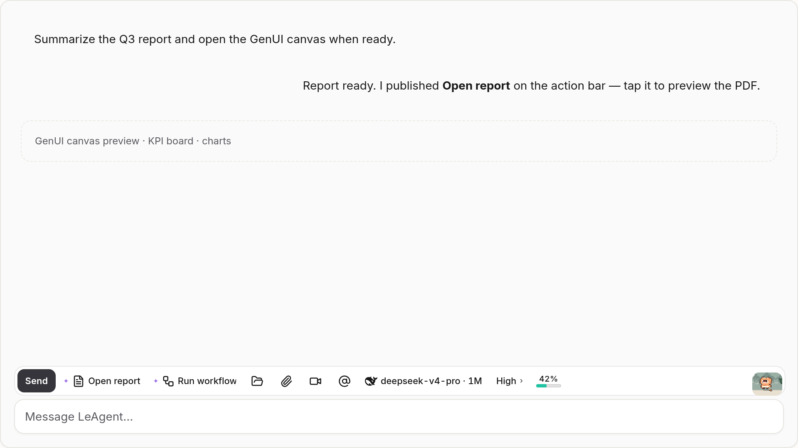
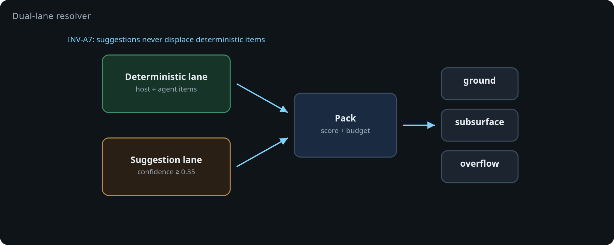

# We built a context-aware action bar for AI agents — here’s what broke, and the architecture that survived

**TL;DR:** We built an open-source action surface for agent chat that sits above the composer and adapts to the current state: model controls, tool approvals, GenUI actions, and agent-proposed next steps. The hard part was not rendering buttons. It was defining who may publish actions, how those actions compete for limited space, and how pointer input remains reliable while the rendered surface is changing.

Repo: [vixues/AIBar](https://github.com/vixues/AIBar)  
Integration: [LeAgent](https://github.com/vixues/LeAgent)



## Why we built it

Agent interfaces are accumulating several independent control systems:

- composer controls such as model, reasoning, attachment, and send/stop
- tool permission prompts
- controls for generated interfaces and files
- suggested follow-up actions
- live run status

Putting all of this in the transcript makes actions hard to find. Putting it all inside the composer creates a permanently crowded input. We wanted a separate action plane: a narrow, context-aware strip where the host application and the agent can expose what is useful *right now*.

The interaction model was inspired in part by Apple’s Touch Bar: a compact strip whose controls change with context. AIBar applies that idea to agent software, while adding explicit provenance, safety gates, and non-AIBar fallback paths.

The obvious implementation is “render an array of React buttons.” That model stopped being sufficient once we added overflow, customization, agent-published items, live context updates, and safety gates.

## The architecture

AIBar is split into layers:

```text
protocol       Item specs, identifiers, validation, wire messages
core           ContextHub, resolver, kernel, WireIngress, HostAdapter SPI
intent         Optional heuristic suggestions
renderer-dom   DOM measurement, paint, pointer handling
react          Surface mount
host           Product projections, action allowlist, confirmation gate
```

The protocol, core, and intent packages do not import React or touch the DOM. Host providers register with `ContextHub`; after an invalidation, the hub pulls their metadata and builds an immutable, revisioned snapshot. The DOM renderer measures the available space, the kernel resolves the item set and geometry, and the renderer commits the resulting frame.

This boundary matters because the layout policy is the product. React mounts the surface, but it does not decide which action wins the last available slot.

## Agents publish data, never UI code

An agent can publish a declarative item:

```json
{
  "id": "agent.aibar.button.open-report",
  "type": "button",
  "labelKey": "Open report",
  "effect": "read",
  "parity": "chat:link-in-reply",
  "action": {
    "name": "open_file",
    "params": {
      "fileId": "<file id>"
    }
  }
}
```

It cannot send arbitrary HTML, JavaScript, React components, or event handlers. In-process item types that can carry code are not accepted on the wire.

The protocol also requires or supplies:

- a stable, globally unique ID
- provenance stamped by the ingress layer and shown visibly in the UI
- an optional effect class—`read`, `write`, or `destructive`—with an explicit effect required for approval items
- `parity`, the fallback path when AIBar is unavailable

Agent-triggered destructive effects pass through host-owned confirmation or approval UI. The suggestion policy permits only `read` and `write`, so destructive work must use an approval flow rather than a suggestion item.

## Limited space needs policy, not just CSS

Actions compete against a real spatial budget. The resolver filters items by visibility and lifetime, evaluates enablement, scores candidates, packs them into the measured width, and uses hysteresis plus a short dwell period to prevent controls from flickering near a breakpoint.

We keep deterministic actions and probabilistic suggestions in separate lanes. Suggestions must clear a confidence threshold and are capped in number; they use only the space left after deterministic actions are laid out. A guessed next step therefore cannot displace Send, Stop, or an approval request.

Deterministic actions that do not fit remain reachable through overflow; the host may also provide a command-palette escape hatch. Suggestions use leftover space only and may be omitted at no functional cost.



## A browser bug that changed our input model

One of the less obvious failures happened during rapid context updates:

1. `pointerdown` lands on a toolbar item.
2. New context causes the surface to re-resolve.
3. The renderer updates the surface and may replace the original DOM node.
4. That node disappears before the browser emits the compatibility `click`.
5. The control appears to ignore the user.

The reliable contract became: arm on `pointerdown`, execute on `pointerup`, and suppress the redundant compatibility `click`. We also added movement thresholds so horizontal scrubbers do not accidentally trigger taps.

This was a useful reminder that a context-aware toolbar is not a static menu. It behaves more like a small real-time UI runtime.

## Context projection without stealing ownership

The chat composer remains the single owner of the draft. It projects callbacks and limited metadata into AIBar, but the bar does not maintain a second copy of the message.

For local typing suggestions, a private composer bridge exposes at most 32 characters immediately before the caret, not the full draft. That prefix never enters `ContextHub`. The emoji and reasoning surfaces remain open across brief focus changes, so the bar does not switch modes while the user is interacting with them.

## The invariants we ended up enforcing

The most useful contracts are:

1. Every action has a non-AIBar fallback or an explicit reason why it does not.
2. Agent transport payloads contain data, never executable UI.
3. Kernel and protocol code stay independent of React and the DOM.
4. Stable IDs are immutable and globally unique.
5. Suggestions never displace deterministic actions.
6. Agent provenance is visible.
7. Agent-triggered destructive work requires a human gate.
8. Malformed publishes are rejected without breaking the surface.

These rules did more for maintainability than any individual component abstraction.

## What I’d like feedback on

We are still exploring a few design questions:

- The deterministic lane already includes local usage frequency. How far can ranking adapt before the surface becomes unpredictable?
- What is the right lifecycle for agent-published actions across turns?
- LeAgent currently does not mount AIBar below a 640px viewport. Should a future mobile version use a denser layout, or continue to rely on fallback paths?
- Is `read` / `write` / `destructive` enough, or should effects use a richer capability model?

If you are building agent UX, I’d be interested in how you handle the boundary between model-authored suggestions and host-owned controls.
