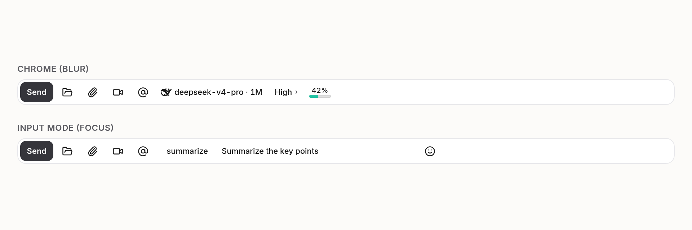
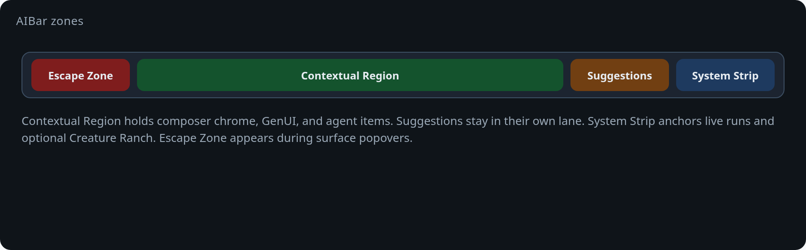
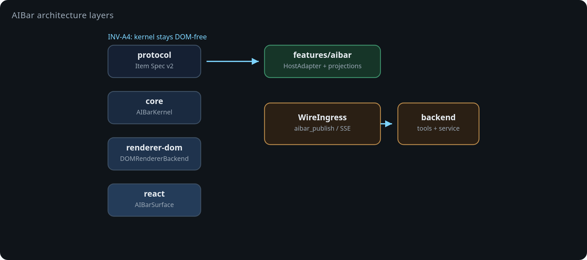
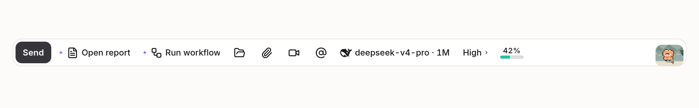
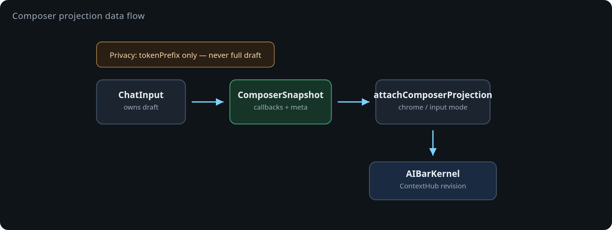
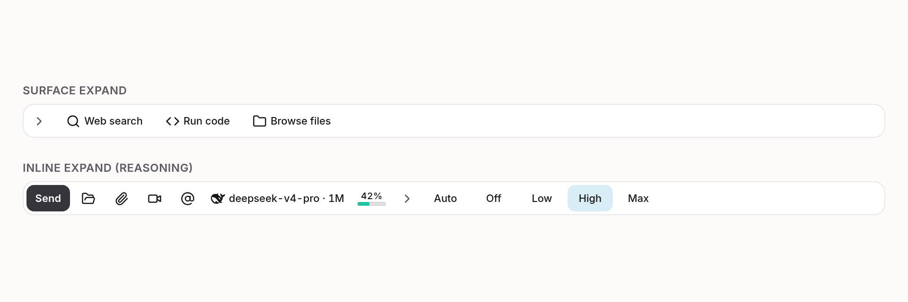
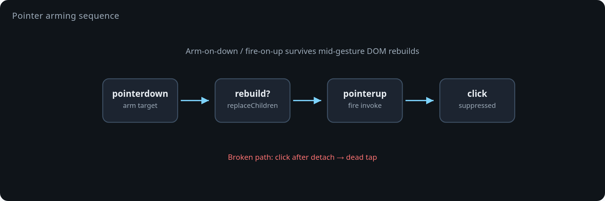
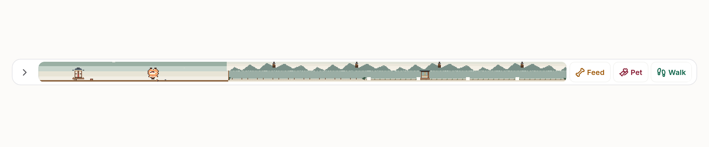

# Introducing AIBar: A Context-Aware Action Surface for Agent Chat

*How LeAgent turns “what you can do next” into a Touch Bar–inspired toolbar — without letting the agent own the DOM.*

---


*Figure 1. AIBar sits above the composer as a persistent action surface — not another row of ad-hoc buttons inside the textarea.*

---

## The problem with “next steps” in agent chat

Modern agent UIs are great at *saying* what to do next. They are much worse at *hosting* those next steps.

Answers bury actions in prose. Toolbars freeze a fixed set of chrome. GenUI canvases, permission prompts, model pickers, and agent follow-ups each invent their own affordance. Users hunt. Agents over-explain. Destructive operations hide behind one more markdown link.

LeAgent’s answer is **AIBar**: a persistent, context-aware **action surface** — an “AI action bar” inspired by AppKit’s NSTouchBar, docked above the chat composer. It is not the text box. It is the place where the product, the host, and the agent agree on *what is actionable right now*, under a shared layout budget, with visible provenance and a human gate for anything destructive.

---

## What AIBar is (and is not)

AIBar is a **context-aware action surface engine**. In product terms: a strip of declarative items whose membership, order, and presentation are resolved from live context — composer focus, open GenUI trees, agent publishes, permission requests, optional Creature Ranch — then painted into a dual-lane toolbar.

It is **not**:

- a second chat input
- a free-form HTML widget the model can invent
- a replacement for markdown interactive blocks (`:::ask`, polls, confirms)

Those markdown actions remain a complementary path: they fill the **composer**. AIBar owns the **bar**.



*Figure 2. Blurred composer → chrome (send, folders, model, reasoning). Focused composer → typing aids (candidates, emoji), with chrome returning on blur.*

---

## A quick tour of the dock

On chat routes (`/`, `/home`, `/home/*`), when AIBar is enabled and the viewport is not mobile, `AIBarDock` mounts the surface above the composer card. Users typically see several zones compete for the same strip:

| Zone | What shows up |
|------|----------------|
| **Composer chrome** | Send / Stop, attach, camera, mention, local folders, model chip, reasoning intensity, context usage |
| **Input mode** | Typing `candidateList`, emoji / character picker, session image scrubber |
| **GenUI zone** | Open / focus / close canvas, locate, enlarge, screenshot, export when a tree or canvas exists |
| **Agent items** | Declarative “next actions” from `aibar_publish`, with an AI provenance badge |
| **Approvals** | Allow / Deny mirrored from chat permission prompts |
| **System Strip** | Live runs, optional Creature Ranch, navigation (often collapsed on chat) |

Overflow does not silently drop capabilities: when the strip runs out of space, items fold into an overflow → command-palette path. Users can pin, hide, reorder, and hold Alt/Option for an **fnMode** alternate set.



*Figure 3. Contextual Region, System Strip, Escape Zone, and overflow — one strip, several presentation modes.*

---

## Architecture: kernel first, React last

AIBar’s package layout deliberately mirrors a future standalone `@aibar/*` monorepo. LeAgent integrates only through an SPI — never by reaching into kernel internals.

```
protocol  →  Item Spec v2, identifiers, wire messages, validation
core      →  AIBarKernel, ContextHub, dual-lane resolver, WireIngress, HostAdapter
intent    →  Heuristic suggestion-lane engine
renderer-dom → DOMRendererBackend (measure / paint / pointer)
react     →  AIBarSurface mount only
features/aibar → LeAgent host: dock, projections, bridges, confirm gate
```

The important boundary is **INV-A4**: the kernel, protocol, and intent packages do not touch the DOM or React. Environment access flows through `RendererBackend` and `AIBarHostAdapter`. React’s job is to mount a container and feed host projections; the kernel owns the plan.



*Figure 4. Protocol → core → renderer → React mount. Host code plugs in via `AIBarHostAdapter` and projections.*

### The kernel loop

At a high level, every frame is the same story:

1. **Context providers** push immutable revision snapshots into `ContextHub` (route, composer metadata, GenUI presence, approvals — not the full draft text).
2. The **dual-lane resolver** decides what fits: a deterministic lane for host/agent items, and a confidence-gated **suggestion lane** that never displaces deterministic items (**INV-A7**).
3. The kernel emits a **RenderFrame** of ops.
4. `DOMRendererBackend` measures, commits, and handles pointer interaction.

Resolve budgets stay tight (on the order of single-digit milliseconds) so the bar can track focus and streaming context without feeling like a separate app.

---

## Item Spec v2: data, never code

Publishers submit **declarative** JSON. The catalog is twenty item types — buttons, toggles, popovers, scrubbers, live status, suggestions, approvals, and more. Three types are **in-process only** (`scrubber`, `hostItemsProxy`, `custom`) because their payloads are code. Agents never get those on the wire (**INV-A3**).

Identifiers use a reverse-URI shape:

```text
<namespace>.aibar.<type>.<key>
```

Examples:

- `com.leagent.aibar.mainbutton.composer-send`
- `agent.aibar.button.open-report`
- `core.aibar.button.escape-close`

Every item declares **`parity`**: the non-AIBar way to accomplish the same thing (or an explicit `none:<reason>`). That is **INV-A1** — no orphan capabilities that exist only on the bar.

Effects are classified as `read` | `write` | `destructive`. Destructive actions always pass a confirmation / approval gate (**INV-A8**). Soft suggestions may not propose destructive work.

```json
{
  "items": [{
    "id": "agent.aibar.button.open-report",
    "type": "button",
    "labelKey": "Open report",
    "icon": "file-text",
    "effect": "read",
    "parity": "chat:link-in-reply",
    "action": {
      "name": "open_file",
      "params": { "fileId": "<file id>" }
    }
  }]
}
```

Agent tools on the server: `aibar_publish`, `aibar_clear`, `aibar_read`. The guide to agents is blunt: publish sparingly (1–3 high-value items), compete for limited space, expect a visible AI badge, and never try to approve yourself.



*Figure 5. Agent items are data with provenance — visible as an AI badge, revocable when the run ends.*

---

## Composer projection: chrome without leaking the draft

The composer remains owned by `ChatInput`. It publishes a **`ComposerSnapshot`** over `composerBridge` — callbacks and metadata, not a second source of truth for message text.

Privacy matters here: ContextHub receives only a short **`tokenPrefix`** (capped) for local typing candidates. The full draft never becomes AIBar context.

Projection also **latches** emoji and reasoning items across brief focus flicker while their popover or inline expand is open, so the strip does not thrash when the user interacts with sub-surfaces.



*Figure 6. The composer projects into the bar; the bar never owns the draft.*

---

## Popovers: surface expand vs inline expand

AIBar borrows Touch Bar vocabulary carefully.

- **`expand: 'surface'`** (default) — the whole bar swaps to the popover’s children, with an **Escape Zone** (close / deny chrome), analogous to `NSPopoverTouchBarItem`.
- **`expand: 'inline'`** — children splice into the ground strip with a leading collapse key (`core.aibar.button.inline-collapse`). Composer reasoning uses this path so intensity controls feel like an extension of the strip, not a mode switch.

Press-and-hold, dismiss, and ground-plan caching are first-class kernel concerns — not one-off React menus.



*Figure 7. Surface expand swaps the bar; inline expand splices controls in place.*

---

## Pointer arming: why toolbar clicks used to feel dead

A subtle DOM hazard shows up when a toolbar rebuilds mid-gesture: `pointerdown` lands on a node, layout commits `replaceChildren`, and the compatibility `click` never fires on the original target.

AIBar’s renderer contracts the primary tap path as **arm on `pointerdown`, fire on `pointerup`**, then suppress the redundant `click`. That, plus strip-pan thresholds and scrubber virtualization, keeps a dense, frequently re-resolved surface feeling trustworthy under the finger and mouse.



*Figure 8. Arm-on-down / fire-on-up survives mid-gesture DOM rebuilds.*

---

## Dual-lane resolve and the human gate

Layout is not “show everything until CSS overflows.” The resolver:

1. Filters by visibility and enablement predicates  
2. Scores candidates (`wP` / `wR` / `wU` / `wC` style weights)  
3. Packs against spatial budget with hysteresis so items do not flicker  
4. Reserves suggestion slots separately, gated by `minConfidence` (default **0.35**)

Suggestions expire (tens of seconds), rate-limit, and never steal deterministic slots. Destructive effects always route through confirm / approval UI. Malformed agent publishes are scrubbed at ingress: a bad payload **never breaks the surface**.


*Figure 9. Suggestions get their own lane — they do not displace host or agent items.*

---

## Creature Ranch (optional system strip)

The System Strip can host a strip-native **Creature Ranch** — a pet / farm scene from LeAgent’s pet-engine, projected by the host. The yard uses in-process `custom` rendering. Agents cannot publish `custom` screens over the wire; that is the same INV-A3 rule that keeps the bar a data surface, not a remote code host.



*Figure 10. Optional ranch chrome — host-owned custom UI, not agent wire.*

---

## How this differs from a normal chat input

| Normal composer | AIBar |
|-----------------|--------|
| Free-text textarea + fixed inline buttons | Separate toolbar above the card |
| Always the same chrome | Context-resolved, overflowed, scored layout |
| React owns every widget | Kernel owns the plan; React mounts; DOM backend paints |
| Model writes markdown chips in the reply | Model publishes declarative bar items (or uses `:::ask` in prose) |
| No spatial budget competition | Host / agent / suggestion lanes compete fairly |
| Destructive = whatever the UI does | Explicit `effect` + human gate |
| Identity = DOM position | Stable reverse-URI ids for diff, persistence, and a11y |

---

## Design invariants worth keeping

These contracts are the product, not just the code review checklist:

| ID | Rule |
|----|------|
| **INV-A1** | Every item declares `parity` — a non-AIBar path exists (or is explicitly waived) |
| **INV-A3** | Wire is data only; no code payloads; no agent `custom` |
| **INV-A4** | Kernel / protocol / intent stay DOM- and React-free |
| **INV-A5** | `customizationIdentifier` is immutable once shipped |
| **INV-A6** | Identifiers are globally unique |
| **INV-A7** | Suggestions never displace deterministic items; provenance is visible |
| **INV-A8** | Destructive work requires confirm / approval; never soft-suggested |

---

## Where the code lives

| Layer | Path |
|-------|------|
| Engine | [vixues/AIBar](https://github.com/vixues/AIBar) (`@aibar/*`; LeAgent submodule `packages/`) |
| Host | `frontend/src/features/aibar/` (`AIBarDock.tsx`, `composerItems/`, projections, `adapter.ts`) |
| Agent tools | `backend/leagent/tools/canvas/aibar.py` |
| Service / API | `backend/leagent/services/aibar/`, `backend/leagent/api/v1/aibar.py` |
| Agent policy | `backend/leagent/prompts/templates/policies/aibar_guide.md` |
| Pet strip | `frontend/src/pet-engine/scenes/aibar-strip.ts` |

---

## Closing

AIBar is LeAgent’s bet that agent products need a **first-class action plane** — as intentional as the transcript and as constrained as a Touch Bar. The model may suggest; the host may project; the user always remains the gate for irreversible work.

If chat is where meaning accumulates, AIBar is where *agency* is laid out: scored, badged, overflowed, and ready for the next tap.

---

---

### Regenerating figures

UI scenes and SVG diagram panels are rendered from the DEV gallery
[`/_dev/aibar-capture`](http://localhost:5173/_dev/aibar-capture)
(Export all), or:

```bash
node scripts/capture-aibar.mjs
```

Assets land in `docs/blog/assets/aibar/`.
